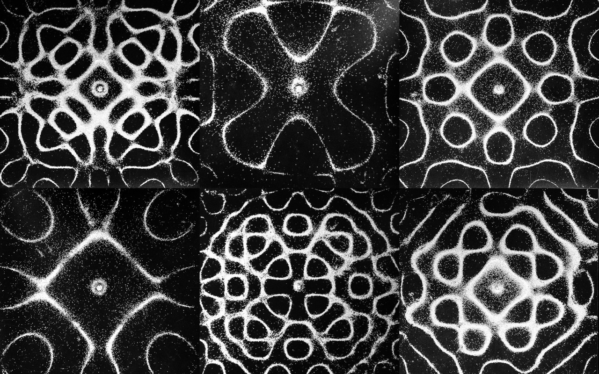
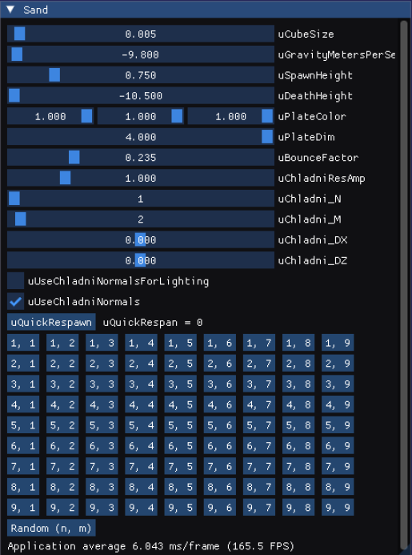

# CS 457 Computer Graphics Shader

This is my working repo used throughout my CS 457 term. The class taught the OpenGL rendering pipeline with GLSL shaders.

## [Final Project: Chladni Plate Simulation](https://github.com/cxhx441/cs457/blob/main/visual_studio/OpenGL_FinalProject/OpenGL/src/Application.cpp)

Chladni plates show the modes of vibration on a rigid surface. Activating the resonance was first done by sliding a violin bow across a metal plate, but today it’s typically done by attaching the metal plate to a
speaker driver. When sand is covering the top of the plate, and the plate is resonating, the sand falls into the gaps
where no movement is occurring (**node**) as the vibrating part of the plate (**antinode**) pushes the sand away. When the
resonance is changed, the sand flows to the new pattern of nodes/antinodes.

*image source: http://dataphys.org/list/images/uploads/2017/09/chladni-plates-wide-wallpaper-1280x800.jpg*

 The main file can be found [here](https://github.com/cxhx441/cs457/blob/main/visual_studio/OpenGL_FinalProject/OpenGL/src/Application.cpp)

The project is primarly written in C++ and OpenGL and utilizes GLSL vertex, geometry, fragment, and compute shaders.

- Several shader storage buffer objects (SSBOs) are set up to represent the sand particles. These hold data such as color, rotation, velocity, and position. The simulation in the linked video uses 128\*128\*128
= 2,097,152 particles which are updated every frame.
- A quad is used to represent the plate. The plate shader uses per-fragment lighting and a toggle in the program allows for the use of bump-mapping to show the amplitude of the resonance across the plate.
- The sand compute shader updates each sand particle by checking if the particle intersects with the plate or if it should continue falling. If it intersects with the plate, 1) the plate normal is used to calculate a **standard reflective bounce vector** and 2) the amplitude of the resonance and the direction of the normal at the hit position are used to calculate a **Chladni resonant vector**. These two vectors are added together as the new velocity of the particle.  Gravity is applied on each frame as well.
- The sand render shader takes the particles positions as vertices, uses a geometry shader to turn them into cubes, then the fragment shader calculates the per fragment lighting,
- These shaders are set up with uniform variables allowing for the user to change the size of the plate, choose whether to show the Chladni resonance amplitudes (with color and bump maps), change the sand particle size, and modify the N and M inputs to the Chladni function.

    
- The Chladni resonance function was modified from this [website](https://paulbourke.net/geometry/chladni/) and this [website](https://phys.libretexts.org/Bookshelves/Waves_and_Acoustics/The_Physics_of_Waves_(Goergi)/11%3A_Two_and_Three_Dimensions/11.03%3A_Chladni_Plates).

### Links

[Project Demo](https://www.youtube.com/watch?v=znFB_isfHLM)

[Project Presentation](https://www.youtube.com/watch?v=Nt-PviVG6I8)
